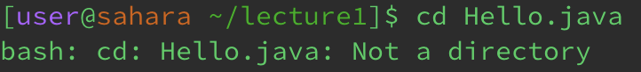
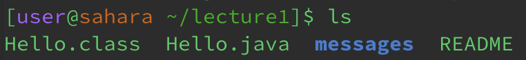
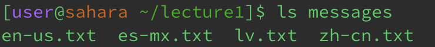
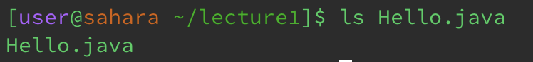
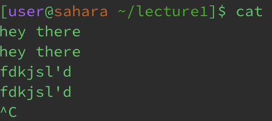
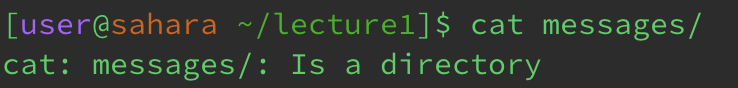
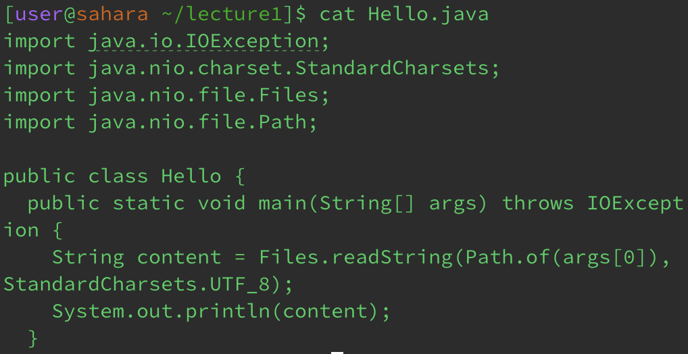

# Lab Report 1

## Commands with cd: 

**cd with no Arguments**

Working Directory: `/home/lecture1`

Output Reasoning: `cd` with no arguments takes you out of the current directory one step lower, so in this situation from inside the `lecture1` directory it goes to the `home` directory. 

**cd with directory arguments**

Working Directory: `/home`

Output Reasoning: `cd` received the directory argument of messages so it moved the path into the messages directory

**cd with file arguments**

Working Directory: `/home/lecture1`

Ouput Reasoning: `cd` needs to move to a directory, so when you pass a file it returns an error message stating that the file is not a directory

## Commands with ls: 

**ls with no arguments**

Working Directory: `/home/lecture1`

Ouput Reasoning: When `ls` has no arguments it lists all the elements within the current working directory

**ls with directory arguments**

Working Directory: `/home/lecture1`

Ouput Reasoning: With `ls` having the directory argument of messages, it lists all the contents within the messages directory

**ls with file arguments**

Working Directory: `/home/lecture1`

Ouput Reasoning: When `ls` has the argument of the file it simply lists the file name as there are no elements within a file as it is not a directory to other files and folders. 

## Comands with cat: 

**cat with no arguments**

Working Directory: `/home/lecture1`

Ouput Reasoning: The `cat` command with out an arguments allows you then to input any kind of text, and from there it will output back the same thing.

**cat with directory arguements**

Working Directory: `/home/lecture1`

Ouput Reasoning: `cat` errors, as it must read a file or some form of text and display that text, while here in the arguments you are inputting a directory.

**cat with file arguments** 

Working Directory: `/home/lecture1`

Ouput Reasoning: The contents/code of the file `Hello.java` is outputted as the `cat` command reads the file and outputs it. 

