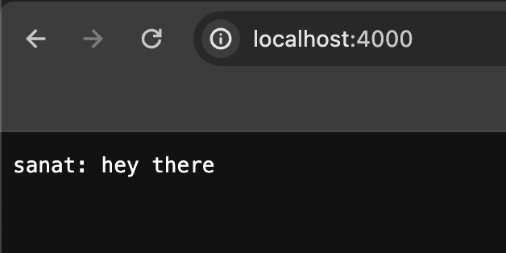
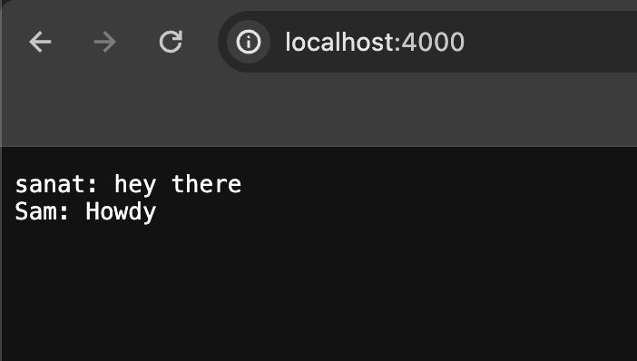

# Lab Report 2

**Code for ChatServer**
```
import java.io.IOException;
import java.net.URI;
import java.util.ArrayList;


class ChatServer {
    public static void main(String[] args) throws IOException {
        if(args.length == 0){
            System.out.println("Missing port number! Try any number between 1024 to 49151");
            return;
        }

        int port = Integer.parseInt(args[0]);

        Server.start(port, new Handler());
    }
}

class Handler implements URLHandler {
    // The one bit of state on the server: a number that will be manipulated by
    // various requests.
    ArrayList<String> user = new ArrayList<>();
    ArrayList<String> message = new ArrayList<>();

    public String printConversation(){
        String conversation = "";
        for (int i = 0; i < user.size(); i++){
            conversation += String.format(user.get(i) + ": " + message.get(i) + "\n");
        }
        return conversation;
    }

    public String handleRequest(URI url) {
        String query = url.getQuery();
        if (url.getPath().equals("/")) {
            return printConversation();
        } 
        else if (url.getPath().contains("/add")) {
            if(query.contains("s=")) {
                String toAdd = query.split("[=&]")[1];
                message.add(toAdd);
                if (query.contains("user=")){
                    String toAdd2 = query.split("=")[2];
                    user.add(toAdd2);
                    return String.format("User = " + toAdd2 + " and message = " + toAdd + " has been done");
                }

                else{
                    return String.format("The url requires s and user in the add method");
                }
            }
                
        }
        return "404 Not Found!";
    }
}
```

**Screenshot Using `/add-message`**


**Screenshot of Results**


**Screenshot Using `/add-message` Again**


**Screenshot of Results**

