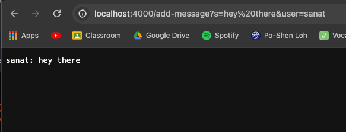
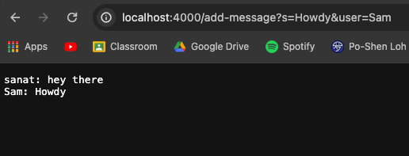

# Lab Report 2

## Part 1

**Code for ChatServer**
```
import java.io.IOException;
import java.net.URI;
import java.util.ArrayList;


class ChatServer {
    public static void main(String[] args) throws IOException {
        if(args.length == 0){
            System.out.println("Missing port number! Try any number between 1024 to 49151");
            return;
        }

        int port = Integer.parseInt(args[0]);

        Server.start(port, new Handler());
    }
}

class Handler implements URLHandler {
    // The one bit of state on the server: a number that will be manipulated by
    // various requests.
    ArrayList<String> user = new ArrayList<>();
    ArrayList<String> message = new ArrayList<>();

    public String printConversation(){
        String conversation = "";
        for (int i = 0; i < user.size(); i++){
            conversation += String.format(user.get(i) + ": " + message.get(i) + "\n");
        }
        return conversation;
    }

    public String handleRequest(URI url) {
        String query = url.getQuery();
        if (url.getPath().equals("/")) {
            return printConversation();
        } 
        else if (url.getPath().contains("/add")) {
            if(query.contains("s=")) {
                String toAdd = query.split("[=&]")[1];
                message.add(toAdd);
                if (query.contains("user=")){
                    String toAdd2 = query.split("=")[2];
                    user.add(toAdd2);
                    return String.format("User = " + toAdd2 + " and message = " + toAdd + " has been done");
                }

                else{
                    return String.format("The url requires s and user in the add method");
                }
            }
                
        }
        return "404 Not Found!";
    }
}
```

**Screenshot Using `/add-message`**



The `handleRequest` method is called, which then calls the `printConversation` method. The relevant argument to the `handleRequest` method is the `URI url`. The `printConversation` mehtod has no arguments. The relevant fields for the class is the `user` arraylist and the `message` arraylist. They are changed, as they go from empty arraylists to the `user` arraylist going from an empty arraylist to having a string element of "sanat". The `message` arraylist goes from empty to including an element: "hey there". 


**Screenshot Using `/add-message` Again**



The `handleRequest` method is called, which then calls the `printConversation` method. The relevant argument to the `handleRequest` method is the `URI url`. The `printConversation` mehtod has no arguments. The relevant fields for the class is the `user` arraylist and the `message` arraylist. They are changed. The `user` arraylist going from having element "sanat" to having two string elements of "sanat" and "Sam". The `message` arraylist goes an element: "hey there" to having "hey there" and "howdy.


## Part 2

**Screenshot of Absolute Path to Private Key**


**Screeenshot of Absolute Path to Public Key**


**Screenshot of Logging Into ieng Account Without a Password**


## Part 3
I did not know that you could use linux commands to start a server, and utilize a account in a system to make a website public to people within the system. Furthermore, I did not realize that I could pass arguments into code from the URL. Additionally, I did not know how webservers requires unique ports to use and that all websites operate on ports, which is simply not always shown. 
