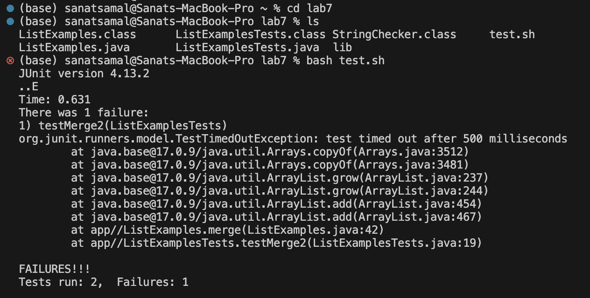
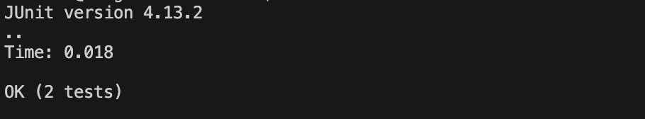

# Lab Report 4

## Step 4: Log into ieng6

Keys Pressed: `ssh <space> ssamal-201@ieng6.ucsd.edu <enter>`
Logs into the server at port 201

## Step 5: Clone your fork of the repository from your Github account (using the SSH URL)

Keys Pressed: `git <space> clone  <space> ssh <space> <command + c> <command + v> <enter>`
Clones the repository after copying the url link from github and placing it in the terminal

## Step 6: Run the tests, demonstrating that they fail

Keys Pressed: `cd <space> lab7 <enter> ls <enter> bash <space> test.sh <enter>`
Goes into the newly cloned lab7 directory, and runs the bash script `test.sh` to see if it works. 

## Step 7: Edit the code file to fix the failing test

Keys Pressed: `vim <space> ListExamples.java <enter> 43jer2:wq <enter>`
Opens the code in `ListExamples.java` and fixes it. 

## Step 8: Run the tests, demonstrating that they now succeed

Keys Pressed: `bash <space> test.sh <enter>`
Reruns the test code and sees it works

## Step 9: Commit and push the resulting change to your Github account (you can pick any commit message!)

Keys Pressed: `git <space> add <space> ListExamples.java <enter> git <space> commit <enter> ifixed <space> code <space> with <space> vim <esc> :wq <enter> git <space> push`
Adds the file to be pushed, adds a commit message, and pushes the changes to the main directory on github. 
