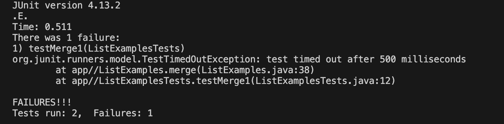
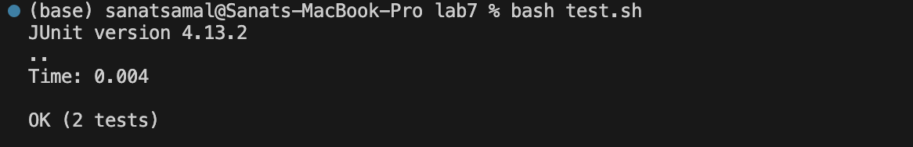
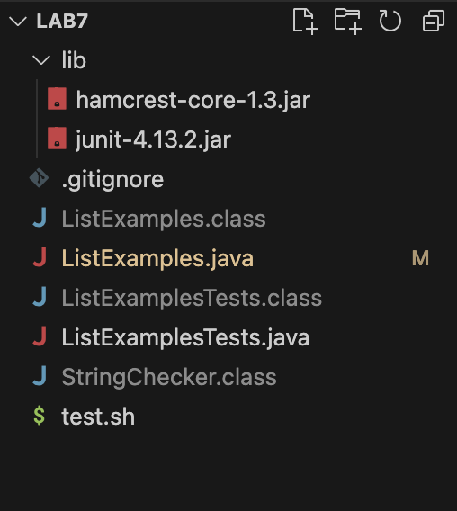

# Lab 5

## Part 1
Anonymous Student:
Hey, I was debugging this code through vim, however I can't seem to figure out the issue. It looks like it is timing out from taking too long, but I don't understand why. Could you help me figure out what is wrong. 



TA: 
Often times when the code is taking too long the issue is that you have an infinite loop somewhere, so I reccomend that you look at your loops and see if they are ending. 

Anonymous Student: 
Hey, thank you so much. You were right turns out there was na infinite loop. On one of the while loops set to when the indez is less than the size of an array, the index was not being incremented, setting it to loop endlessly. 



The file & directory structure needed



The contents of each file before fixing the bug
ListExamples.java : 
```
import java.util.ArrayList;
import java.util.List;

interface StringChecker { boolean checkString(String s); }

class ListExamples {

  // Returns a new list that has all the elements of the input list for which
  // the StringChecker returns true, and not the elements that return false, in
  // the same order they appeared in the input list;
  static List<String> filter(List<String> list, StringChecker sc) {
    List<String> result = new ArrayList<>();
    for(String s: list) {
      if(sc.checkString(s)) {
        result.add(0, s);
      }
    }
    return result;
  }


  // Takes two sorted list of strings (so "a" appears before "b" and so on),
  // and return a new list that has all the strings in both list in sorted order.
  static List<String> merge(List<String> list1, List<String> list2) {
    List<String> result = new ArrayList<>();
    int index1 = 0, index2 = 0;
    while(index1 < list1.size() && index2 < list2.size()) {
      if(list1.get(index1).compareTo(list2.get(index2)) < 0) {
        result.add(list1.get(index1));
        index1 += 1;
      }
      else {
        result.add(list2.get(index2));
        index2 += 1;
      }
    }
    while(index1 < list1.size()) {
      result.add(list1.get(index1));

    }
    while(index2 < list2.size()) {
      result.add(list2.get(index2));
      // change index1 below to index2 to fix test
      index2 += 1;
    }
    return result;
  }
```

ListExamplesTest: 
```
import static org.junit.Assert.*;
import org.junit.*;
import java.util.*;
import java.util.ArrayList;


public class ListExamplesTests {
        @Test(timeout = 500)
        public void testMerge1() {
                List<String> l1 = new ArrayList<String>(Arrays.asList("x", "y"));
                List<String> l2 = new ArrayList<String>(Arrays.asList("a", "b"));
                assertArrayEquals(new String[]{ "a", "b", "x", "y"}, ListExamples.merge(l1, l2).toArray());
        }

        @Test(timeout = 500)
        public void testMerge2() {
                List<String> l1 = new ArrayList<String>(Arrays.asList("a", "b", "c"));
                List<String> l2 = new ArrayList<String>(Arrays.asList("c", "d", "e"));
                assertArrayEquals(new String[]{ "a", "b", "c", "c", "d", "e" }, ListExamples.merge(l1, l2).toArray());
        }

}
```


test.sh:
```
javac -cp .:lib/hamcrest-core-1.3.jar:lib/junit-4.13.2.jar *.java
java -cp .:lib/hamcrest-core-1.3.jar:lib/junit-4.13.2.jar org.junit.runner.JUnitCore ListExamplesTests
```


The full command line (or lines) you ran to trigger the bug
`bash test.sh`

A description of what to edit to fix the bug
You go into the ListExamples.java file through vim, and on the index1 loop, you add index1 += 1, so that it increments for the loop to end. 
Hence you change this: 
```
while(index1 < list1.size()) {
  result.add(list1.get(index1));
}
```
to :
```
while(index1 < list1.size()) {
  result.add(list1.get(index1));
  index1 += 1;
}
```


## Part 2 - Reflection

Something cool that I learned this quarter was the overall linux commands, but especially the vim command. I find it extremely usefull, especially when I want to make some small change in my code before rerunning it in the terminal. I also really ennjoyed bash scripts, as I had never thought of the usefullness of having a file run multiple linux commands together, making repeated processes much easier and quicker. 
